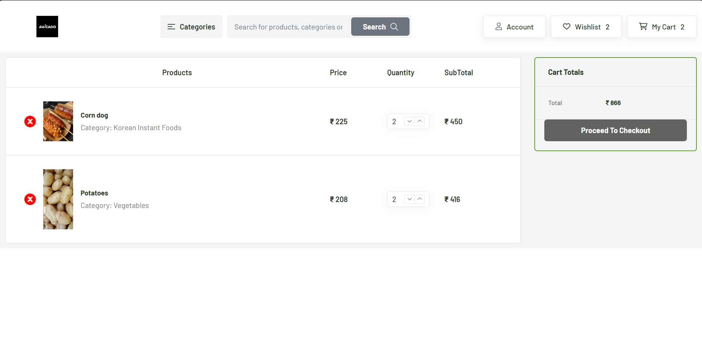

# Avocado Grocery Webapp
An advanced e-commerce web application built with the MERN stack (MongoDB, Express.js, React, Node.js), providing a platform for users to explore, manage, and purchase products. This project was developed to showcase full-stack development with the MERN stack and integrates various key features, including user authentication, product filtering, and a cart system.
<p>
   
</p>

## Features

- **User Authentication**: Users can sign up, log in, and make purchases once authenticated.
<p>
   
</p>  

- **Product Page**: Displays all available products, with category filtering options.
<p>
   
</p>

- **Cart System**: Users can add products to their cart, update quantities, and proceed to checkout.
<p>
   
</p> 

- **Admin Control**: Admin users can add, update, and manage products, categories, and orders.
<p>
   
</p> 

- **Payment Gateway Integration**: Integrated payment system for processing user orders.
<p>
   
</p> 

## Technologies Used

- **Frontend**: React.js,
- **Backend**: Node.js, Express.js
- **Database**: MongoDB
- **Image Storage**: Cloudinary
- **Deployment**: Render (Backend), Netlify (Frontend)

## Project Structure

- **Frontend**: Built with React and Redux, providing a dynamic user interface.
- **Backend**: Built with Node.js and Express.js, handling API requests, user authentication, and product management.
- **Database**: MongoDB for secure and efficient data storage.
- **Image Storage**: Cloudinary for product image management.

## How It Works

1. **Home Page**: Users can explore products and filter them by categories.
2. **Sign Up / Log In**: Users can register or log in to their account.
3. **Product Page**: Logged-in users can view detailed product information and add items to their cart.
4. **Admin Controls**: Admins can manage product data, including adding new products, updating details, and deleting items.
5. **Cart & Checkout**: Users can manage their cart and proceed to the payment gateway for checkout.

## Installation

1. Clone the repository:
   ```bash
   git clone https://github.com/zukachin/Grocery-webapp.git
   ```
2. Install dependencies:
   ```bash
   cd Grocery-webapp
    npm install
   ```
3. Configure environment variables for MongoDB and Razorpay in .env.
    ```bash
    DBURI="your-mongodb-uri"
    CLOUDINARY_CLOUD_NAME="your-cloudinary-cloud-name"
    CLOUDINARY_API_KEY="your-cloudinary-api-key"
    CLOUDINARY_API_SECRET="your-cloudinary-api-secret"
    SECRET="your-jwt-secret"
    KEY_ID="razorpay-id"
    KEY_SECRET="razorpay-secret-key"
   ```
4. Start the server:
   Frontend:
    ```bash
   cd frontend
   npm run dev
   ```
   Backend:
     ```bash
   cd backend
   npm start
   ```


